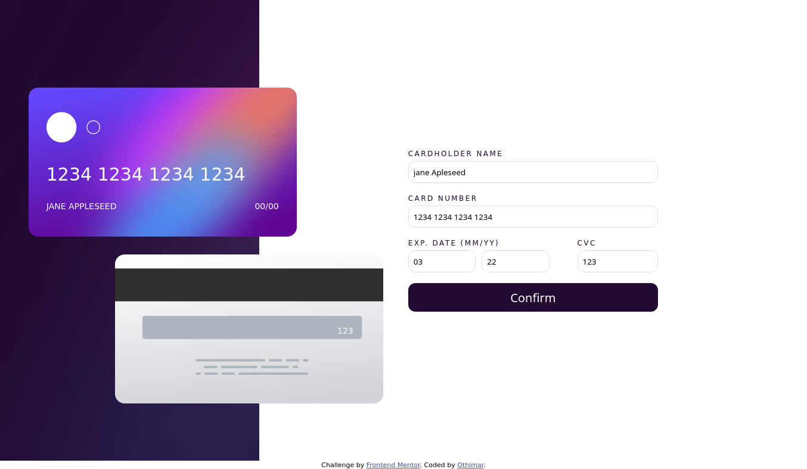

# Frontend Mentor - Interactive card details form solution

This is a solution to the [Interactive card details form challenge on Frontend Mentor](https://www.frontendmentor.io/challenges/interactive-card-details-form-XpS8cKZDWw). Frontend Mentor challenges help you improve your coding skills by building realistic projects. 

## Table of contents

- [Overview](#overview)
  - [The challenge](#the-challenge)
  - [Screenshot](#screenshot)
  - [Links](#links)
- [My process](#my-process)
  - [Built with](#built-with)
  - [What I learned](#what-i-learned)
- [Author](#author)


## Overview

### The challenge

Users should be able to:

- Fill in the form and see the card details update in real-time
- Receive error messages when the form is submitted if:
  - Any input field is empty
  - The card number, expiry date, or CVC fields are in the wrong format
- View the optimal layout depending on their device's screen size
- See hover, active, and focus states for interactive elements on the page

### Screenshot




### Links

- Solution URL: [Github](https://github.com/othimar/frontend-mentor-interactive-card-details-form-main/upload/main)
- Live Site URL: [Add live site URL here](https://your-live-site-url.com)

## My process

### Built with

- Semantic HTML5 markup
- CSS custom properties
- Vanilla Javascript


### What I learned
- How to do a rounded gradient border
- The fact that by default button type is set on 'submit'
- How to use 'focusin' and 'focusout' events
- How to remove  items from an HTMLCollection
```js
  while(errorMsgs.length>0){
    errorMsgs[0].remove();     
  }
```
- JSDoc comments
-How to use CSS variable in Javascript.
```js
  getComputedStyle(document.documentElement).getPropertyValue('--gradient');
```


## Author

- Frontend Mentor - [@othimar](https://www.frontendmentor.io/profile/othimar)
- Twitter - [@othimarPele](https://www.twitter.com/othimarpele)


